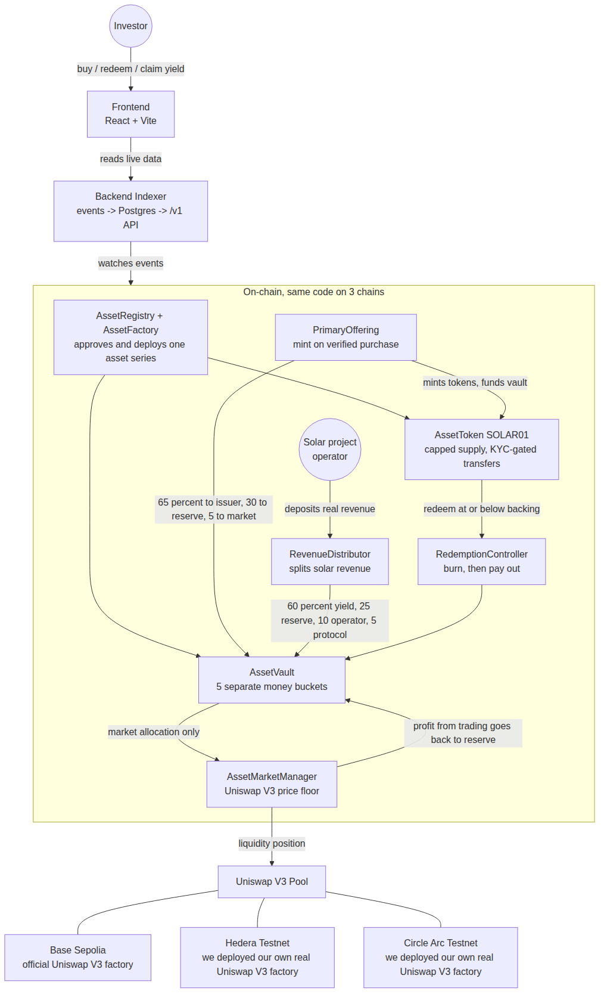

# Arc-Reserve

**Real assets. Programmable liquidity.**

Arc-Reserve is a launchpad for tokenizing real-world green and renewable energy assets — solar,
wind, hydro, and similar projects. A project owner raises money from investors by selling a token,
instead of going through a bank. To show how it works end to end, we use one real example: a 50 MW
solar farm in Indonesia, called **Solar Indonesia 01 (SOLAR01)** — one project on the platform, not
the limit of what it supports.

The token is not a share of a company, and it's not ownership of the underlying project. It's a
claim on a fixed part of the real money the project makes — for SOLAR01, that's electricity sales.
Investors get paid in stablecoin as the project earns revenue, and they can exit any time by
redeeming their tokens from a protected reserve — no need to find a buyer first.

What makes Arc-Reserve different: part of every raise is locked into a real Uniswap V3 liquidity
pool. This creates a price floor under the token, so the price can't crash to zero the way many
token launches do.

---

## Live on three testnets

We deployed the same system to three chains. On Base Sepolia we use the official Uniswap V3
factory that's already there. Hedera and Arc don't have an official Uniswap V3 testnet yet, so we
deployed the real Uniswap V3 factory ourselves on both — same original Uniswap code, not a mock.

| Chain | Token | Vault | Market Manager (Uniswap wrapper) | Uniswap Pool |
| --- | --- | --- | --- | --- |
| Base Sepolia (84532) | `0xF06c...abFf` | `0x0CC5...bC46` | `0xEf1a...aCab3` | `0x1A87...22F29` |
| Hedera Testnet (296) | `0x2a92...6827` | `0x1F52...9428c8` | `0xaA6C...86478c2` | `0xcb77...73c6d31` |
| Arc Testnet (5042002) | `0x18c2...176ff795` | `0x6FE4...225f9ffA` | `0xbd50...78F7c7` | `0xA325...913A28` |

Full addresses for every contract on every chain are in `contracts/deployments/<chainId>.json`.

---

## Architecture



(Mermaid source at `docs/diagrams/architecture.mmd`, renders directly on GitHub too.)

In short: an investor buys through the frontend, the frontend reads live numbers from our backend,
the backend reads events straight from the chain. On-chain, one asset system (token, vault,
offering, revenue splitter, redemption) handles the money, and a separate Market Manager holds a
real Uniswap V3 position that acts as the price floor. Profit from real trading against that
position flows back into the reserve, which is what lets the floor go up over time.

---

## How the money moves

When someone buys tokens, the money splits automatically: **65% to the project operator, 30% into
the protected reserve, 5% into the Uniswap liquidity position.** This is enforced in the smart
contract (`PrimaryOffering.sol`), not a policy we could quietly change.

When the project sends in real revenue — for SOLAR01, that's electricity sold to the grid — it
splits again: **60% to token holders as yield, 25%
into the reserve, 10% to the operator, 5% to us as a protocol fee** (this shifts to 40/45/10/5 if
the reserve falls behind its schedule, to protect investors first). This is enforced in
`RevenueDistributor.sol`, capped on-chain at a maximum 10% protocol fee.

The reserve never funds the protocol's own fees, and the Market Manager can never mint new tokens —
it can only trade tokens that were explicitly handed to it.

---

## Why these three technologies

**Uniswap V3.** Our price floor only means something if there's real liquidity behind it, not a
promise. Uniswap V3 lets us put liquidity exactly where we want it — one range as the floor, one
around fair value, one for price discovery — from the same locked capital. Because Uniswap V3 is
the most tested AMM on EVM chains, we could write one Market Manager contract and run it unchanged
on all three of our chains.

- Real integration, not a mock: `AssetMarketManager.sol` — `addLiquidity` (line 298),
  `removeLiquidity` (line 334), `collectFees` (line 380), `swapExactInput` (line 449),
  `uniswapV3MintCallback` (line 605), `uniswapV3SwapCallback` (line 620).
- Where there's no official Uniswap V3 testnet (Hedera, Arc), we deploy the real Uniswap V3 factory
  ourselves: `contracts/script/DeployUniswapFactory.s.sol`.

**Hedera.** Hedera runs carbon-negative — a good fit for a platform financing green and renewable
energy projects. Hedera
also has its own Asset Tokenization Studio (ATS) for compliant real-world-asset tokens, which is
close to what we built by hand (an ERC-3643-style `IdentityRegistry` + `ModularCompliance`). Our
full SOLAR01 system is live on Hedera Testnet (chain 296) through Hedera's JSON-RPC relay.
*Honest note: we do not yet use Hedera's ATS toolkit itself — our compliance layer is our own
separate build. Integrating ATS is on our roadmap, not shipped today.*

**Circle Arc.** Arc is Circle's stablecoin-native chain — gas is paid in USDC, and transactions
finish in under a second. Our whole product is stablecoin-settled (invest in stablecoin, earn yield
in stablecoin, redeem for stablecoin), so a chain built around stablecoins is a natural fit. Our
full SOLAR01 system is live on Arc Testnet (chain 5042002), including our own Uniswap V3 deployment.
*Honest note: our current stablecoin on Arc is a test token called MockUSD, not Circle's real
testnet USDC — swapping to real testnet USDC is a near-term follow-up, not done yet.*

---

## Documentation

Taking over this project? Start with [HANDOVER.md](HANDOVER.md) — current state, what remains,
and the onboarding gate.

| Document | Purpose |
| --- | --- |
| [System specification](docs/SYSTEM_SPEC.md) | Canonical current contract behavior and formulas |
| [Architecture](docs/ARCHITECTURE.md) | Components, trust boundaries, and flows |
| [Product requirements](docs/PRD.md) | Users, lifecycle, requirements, acceptance criteria |
| [Business model](docs/BUSINESS_MODEL.md) | Fundraising, supply, utility, and revenue model |
| [Decision log](docs/DECISIONS.md) | Accepted decisions and unresolved owner choices |
| [Market making](docs/MARKET_MAKING.md) | ARC Liquidity Engine positions, safety, tests |
| [Backend/indexer](docs/BACKEND_INDEXER.md) | API, event ingestion, reorg handling, OHLC design |
| [Frontend](docs/FRONTEND.md) | Routes, real vs. mock behavior, integration plan |
| [Testing](docs/TESTING.md) | Suite map, coverage, commands, production test gaps |
| [Security](docs/SECURITY.md) | Threat model, emergency behavior, pre-production work |
| [Demo](docs/DEMO.md) | Local deployment and presentation runbook |
| [Deploy — backend](docs/DEPLOY_BACKEND.md) | Backend deploy runbook |
| [Deploy — frontend](docs/DEPLOY_FRONTEND.md) | Frontend deploy runbook |

---

## Running it yourself

Prerequisites: Foundry (`forge`, `anvil`, `cast`), Node.js 20+.

**Contracts**

```bash
cd contracts
forge build
forge test
```

Start a local chain and deploy the seeded demo:

```bash
anvil
cd contracts
forge script script/DeployLocal.s.sol:DeployLocal --rpc-url http://127.0.0.1:8545 --broadcast
```

Deploy to a real testnet (Base Sepolia, Hedera, or Arc):

```bash
forge script script/DeployTestnet.s.sol:DeployTestnet --rpc-url $RPC_URL --broadcast --slow
```

Addresses land in `contracts/deployments/<chainId>.json`.

**Backend**

```bash
cd backend
npm install
npm run migrate
npm run dev
```

**Frontend**

```bash
cd frontend
cp .env.example .env.local
npm install
npm run dev   # http://localhost:3000
```

---

## Test baseline

- 247+ Foundry tests, 0 failing, 0 skipped, including 7 stateful financial invariants.
- `AssetMarketManager` (the Uniswap wrapper): 98.28% line coverage, 73.47% branch coverage.
- Frontend: typecheck, lint, unit tests, and build all passing.

Coverage is not an audit. This has not been audited. The local mock pool used for fast tests is a
callback harness, not a real AMM simulation — the real Uniswap V3 pools on Base Sepolia, Hedera,
and Arc are the genuine article.

---

## What's honestly not done yet

We'd rather list this than have a judge find it first:

- The public frontend page is a concept/landing page today — it doesn't yet call the live backend
  or support wallet actions (buy, redeem, claim). The backend API and the contracts both work; the
  wiring between the frontend and them is the next step.
- We don't use Hedera's Asset Tokenization Studio yet — our compliance layer is a separate,
  ERC-3643-style build.
- Our stablecoin is a test token (MockUSD), not Circle's real testnet USDC.
- Fundraising mints immediately on purchase today; escrowed, threshold-based settlement (fully
  raised / partially raised / failed) is designed but not built.
- No mainnet deployment anywhere, by design — this is a testnet-only hackathon build.

See [docs/SECURITY.md](docs/SECURITY.md) before extending this beyond a demo.